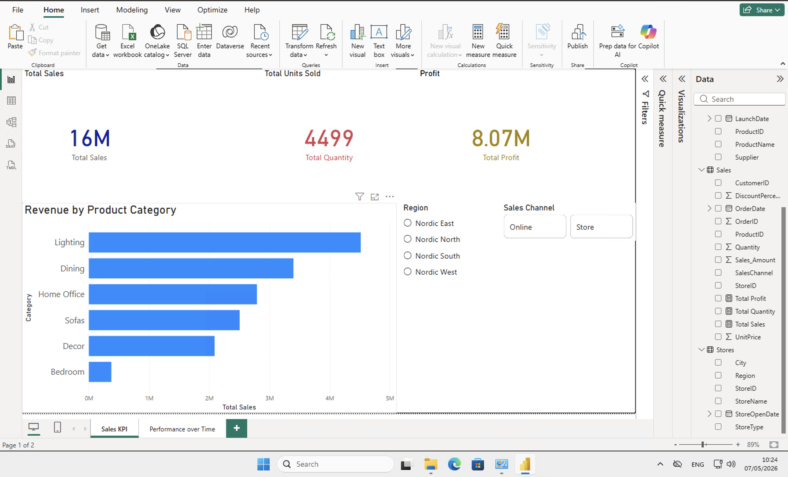
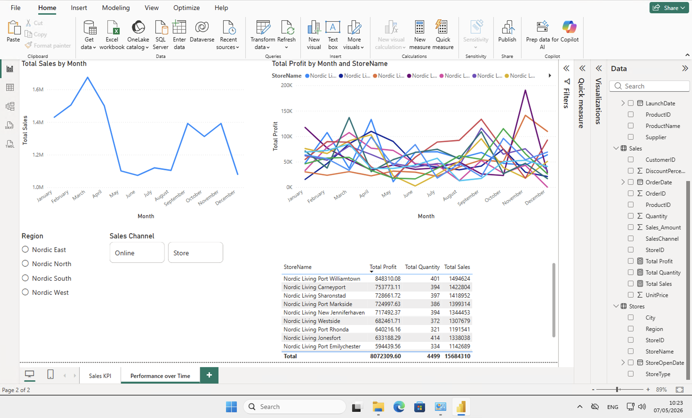
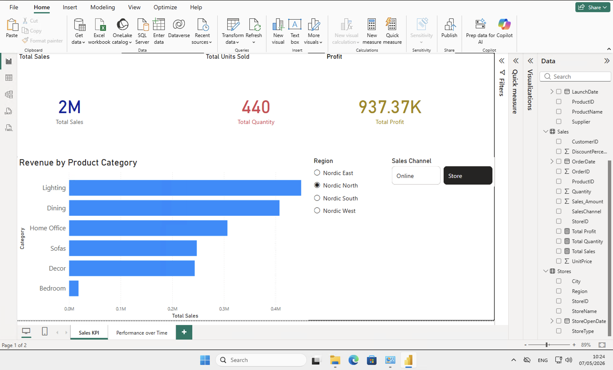
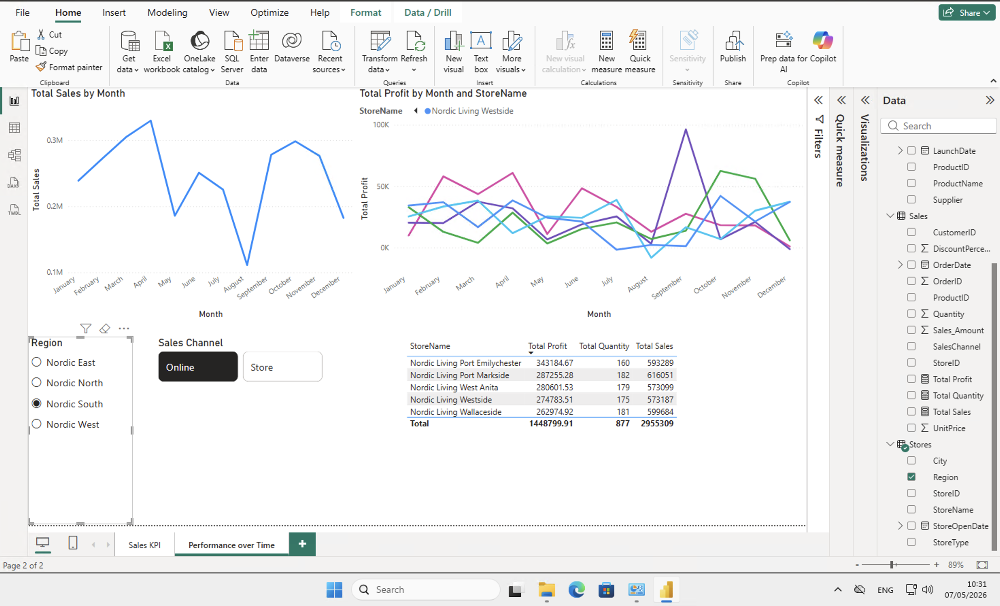

# Nordic Living — BI Dashboard (Power BI)

Interactive sales & performance dashboard built end-to-end in Power BI Desktop, covering the full BI workflow: **Extract → Transform → Model → Analyze → Visualize**.

> **Context:** Built during the *Decision Making with Business Intelligence and Data-driven Analysis (DEMBIDA, VT2026)* course at Stockholm University, applying lab guidance on a synthetic Nordic furniture retailer dataset. The dataset and lab structure were provided by the course; the modeling decisions, DAX measures, and report design were implemented and reflected on independently.

---

## 📊 Dashboard Preview

### Page 1 — Sales KPI Overview


### Page 2 — Performance over Time


### Interactive Filtering — Region Slicer Applied


### Drill-Down — Specific Region Performance


---

## 🎯 Business Questions Answered

- What are the top-performing product categories by revenue?
- How do total sales, units sold, and profit break down across stores?
- How does monthly sales performance vary across the year?
- Which stores drive the highest profit, and how does that change by region or sales channel?
- How do online sales compare to in-store sales across regions?

---

## 🛠️ Tech Stack

| Layer | Tool / Language |
|---|---|
| Data ingestion | Power Query (Get Data → Text/CSV) |
| Transformation (ETL) | Power Query / M language |
| Data modeling | Power BI Model View (star schema) |
| Calculations | DAX (Data Analysis Expressions) |
| Visualization | Power BI Desktop |

---

## 🏗️ Data Model — Star Schema

The model follows the classic Kimball star schema pattern: one fact table at the center, three conformed dimensions surrounding it.

```
                    ┌──────────────────┐
                    │    Customers     │
                    │  (Dimension)     │
                    │  CustomerID (PK) │
                    └────────┬─────────┘
                             │ 1
                             │
                             ▼ *
┌──────────────────┐    ┌────────────────────┐    ┌──────────────────┐
│     Stores       │ 1  │       Sales        │ *  │     Products     │
│  (Dimension)     │◄───┤   (Fact Table)     ├───►│   (Dimension)    │
│  StoreID (PK)    │ *  │  OrderID (PK)      │ 1  │  ProductID (PK)  │
└──────────────────┘    │  OrderDate         │    └──────────────────┘
                        │  CustomerID (FK)   │
                        │  ProductID (FK)    │
                        │  StoreID (FK)      │
                        │  Quantity          │
                        │  UnitPrice         │
                        │  DiscountPercent   │
                        │  Sales_Amount      │
                        └────────────────────┘
```

**Relationships:** All three are configured as **Many-to-One (\*:1)** with **Single** cross-filter direction — dimensions filter the fact, never the reverse.

---

## ⚙️ ETL Steps Performed (Power Query)

### Sales (fact table)
- Corrected data types: `OrderDate` → Date, `Quantity` → Whole Number, `UnitPrice` and `DiscountPercent` → Decimal Number
- Replaced null/blank values in `DiscountPercent` with `0` to prevent calculation errors downstream
- Created calculated column `Sales_Amount = [Quantity] * [UnitPrice] * (1 - [DiscountPercent])` to compute net revenue per transaction

### Products (dimension)
- Corrected types: `CostPrice` → Decimal, `LaunchDate` → Date

### Customers (dimension)
- Corrected `Age` → Whole Number
- Standardized `City` to UPPERCASE for consistent grouping (handles entries like "gothenburg" vs "Gothenburg")

### Stores (dimension)
- Corrected `StoreOpenDate` → Date

---

## 📐 DAX Measures

Three measures power the dashboard. The third uses `SUMX` + `RELATED` to traverse the star schema for cost-aware profit calculation.

```dax
Total Sales =
    SUM ( Beginner_Sales[Sales_Amount] )
```

```dax
Total Quantity =
    SUM ( Beginner_Sales[Quantity] )
```

```dax
Total Profit =
    SUMX (
        Beginner_Sales,
        Beginner_Sales[Sales_Amount]
            - ( Beginner_Sales[Quantity] * RELATED ( Beginner_Products[CostPrice] ) )
    )
```

**Why `SUMX` + `RELATED`?** A regular `SUM` would aggregate first and lose row-level cost context. `SUMX` iterates row by row in the fact table; `RELATED` looks up the matching `CostPrice` from the Products dimension via the active relationship. This pattern only works *because* the star schema is correctly configured.

---

## 📈 Report Pages

| Page | Visuals | Purpose |
|---|---|---|
| **Sales KPI** | KPI cards (Total Sales, Total Units, Total Profit) · Bar chart (Revenue by Category) · Slicers (Region, Sales Channel) | At-a-glance executive overview |
| **Performance over Time** | Line chart (Sales by Month) · Multi-line chart (Profit by Month and Store) · Store-level table · Slicers | Trend analysis and store comparison |

---

## 🔍 Key Insights from the Data

- **Lighting** is the highest-revenue category (~5M SEK), followed by Dining and Home Office
- **Total profit margin** ≈ 51% across all 8.07M SEK profit on 16M SEK in sales — strong unit economics for the dataset
- **Sales seasonality** shows a March peak (~1.6M SEK) followed by a mid-year dip and a Q4 recovery — consistent with retail furniture cycles
- **Top store** (Nordic Living Port Williamtown) generates ~10.5% of total sales (1.49M of 15.68M) — a relatively healthy distribution rather than over-reliance on one location

---

## 💡 What I Learned

1. **Star schemas aren't just organizational — they change DAX behavior.** `RELATED()` only works because the Sales→Products relationship exists with the correct cardinality and direction. Without it, the cost lookup fails silently or returns blanks.

2. **Transform before you load.** Doing data cleanup in Power Query (rather than after loading) keeps the model lean and the refresh predictable. The discipline of clicking *Transform Data* instead of *Load* is a small habit with large downstream payoff.

3. **Filter context is everything.** Every slicer interaction is just filter context propagating through the model to visuals. Once I understood this conceptually, debugging unexpected visual results became dramatically easier — the question is always "what is the current filter context, and what relationships does it travel through?"

4. **`SUM` vs `SUMX`** is a meaningful distinction. `SUM` aggregates a single column; `SUMX` iterates row-by-row and is essential when the calculation depends on multiple columns or related-table values per row.

---

## 🗂️ Repository Structure

```
nordic-living-bi-dashboard/
├── README.md
├── NordicLiving_Dashboard.pbix     # Power BI report file
├── data/
│   ├── Beginner_Sales.csv          # Fact table (200 transactions)
│   ├── Beginner_Products.csv       # Product dimension (10 items)
│   ├── Beginner_Customers.csv      # Customer dimension (25 customers)
│   └── Beginner_Stores.csv         # Store dimension (3 stores)
└── screenshots/
    ├── 01_sales_kpi_overview.png
    ├── 02_performance_over_time.png
    ├── 03_region_filter_applied.png
    └── 04_drill_down_view.png
```

---

## ▶️ How to Reproduce

1. Clone or download this repository
2. Open `NordicLiving_Dashboard.pbix` in **Power BI Desktop** (free download from Microsoft)
3. If the data source paths need to be re-pointed: *Home → Transform Data → Data Source Settings → Change Source* and select the `data/` folder
4. Click *Refresh* to reload the model

> Power BI Desktop is free and works on Windows. No Microsoft account or Power BI Service license is required to open and explore the report locally.

---

## 🚀 What I'd Do Next

If extending this project beyond the lab scope, I would:

- **Scale the dataset** — apply the same pipeline to a 100k+ row dataset to see where the model performance changes
- **Add a date dimension table** to enable proper time-intelligence DAX (`SAMEPERIODLASTYEAR`, `YTD`, etc.)
- **Add Slowly Changing Dimension (SCD Type 2)** logic to the Products table to track price/cost changes over time
- **Migrate the pipeline to Microsoft Fabric** — ingest into a Lakehouse, transform with PySpark notebooks, and connect Power BI via DirectLake to compare the experience against the desktop workflow
- **Build a fraud / anomaly detection page** if the dataset included transaction-level signals

---

## 🎓 Course Context

- **Course:** Decision Making with Business Intelligence and Data-driven Analysis (DEMBIDA, VT2026)
- **Institution:** Department of Computer and Systems Sciences (DSV), Stockholm University
- **Lab guidance:** Workneh Y. Ayele
- **Workflow:** Extract → Transform → Load → Model → Analyze → Visualize

---

## 📬 Contact

**Amirreza Sadraei**
MSc Computer & Systems Sciences, Stockholm University
[LinkedIn](https://www.linkedin.com/) · [Email](mailto:ar.sadraei@outlook.com)

> Building toward a career in BI / Data Engineering. Open to feedback and conversation.
